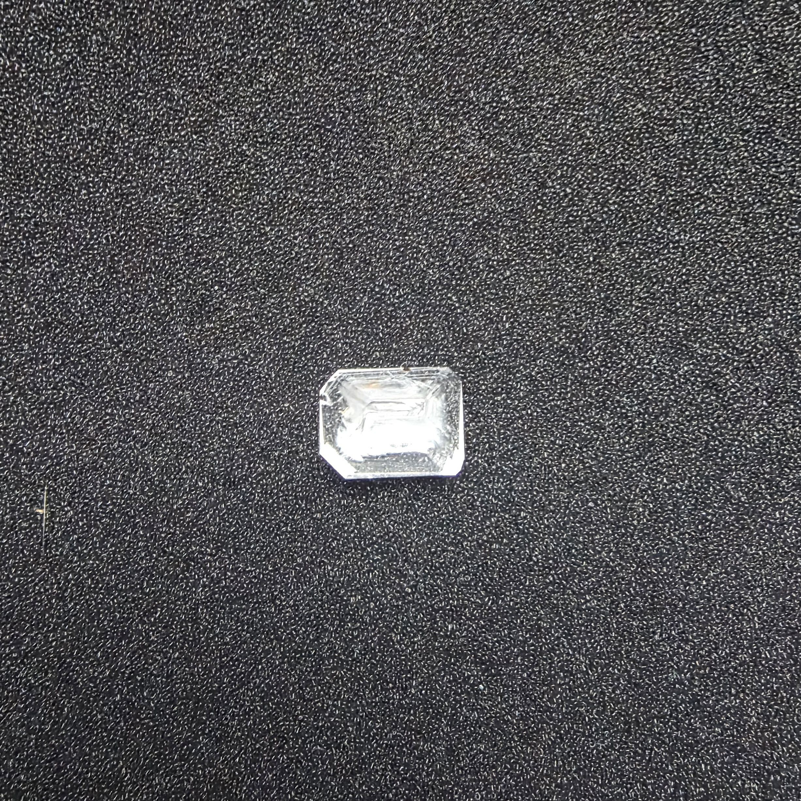
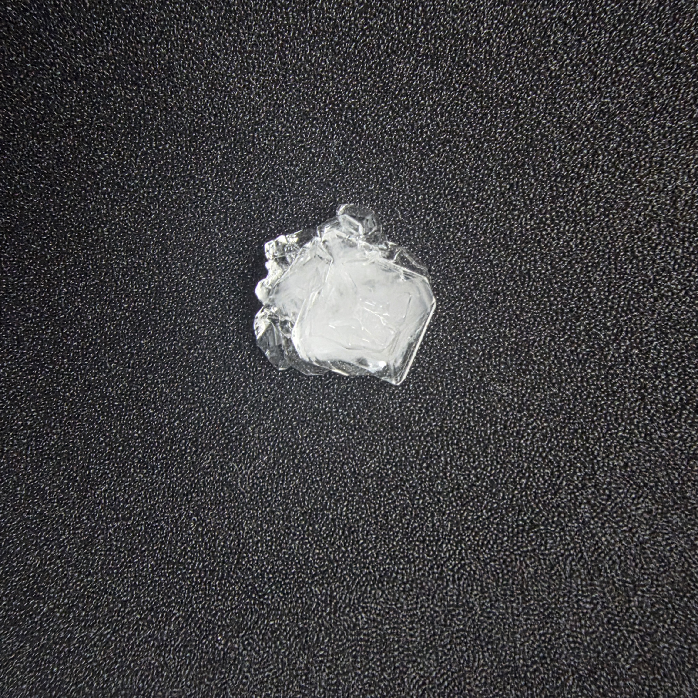
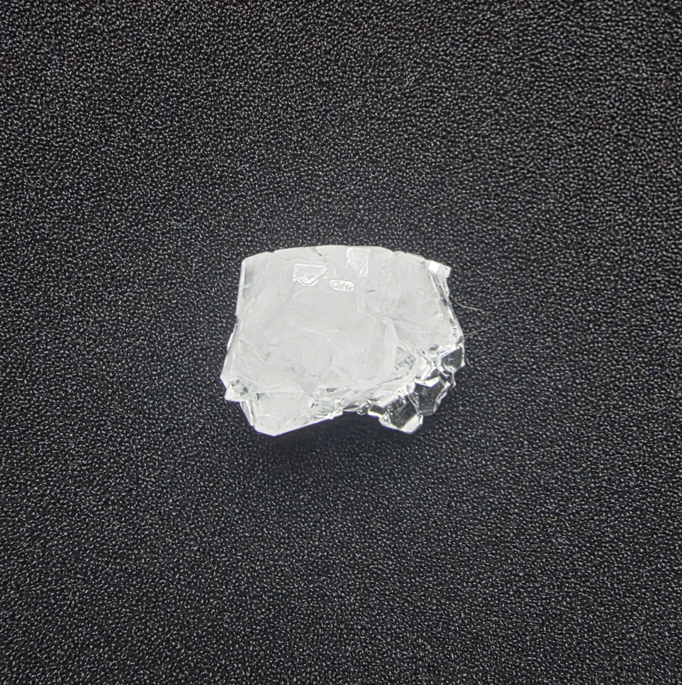
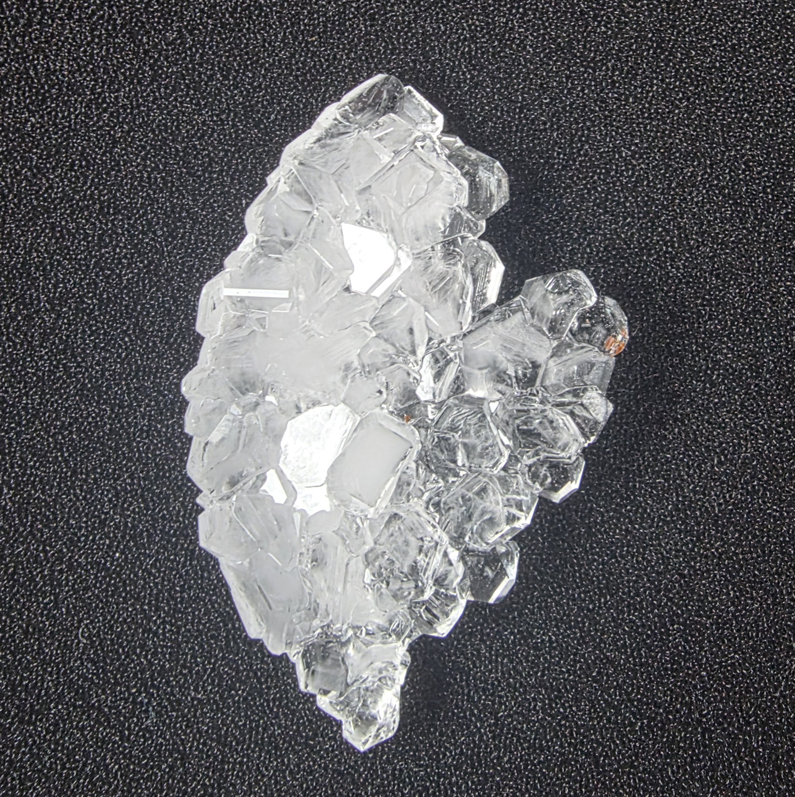
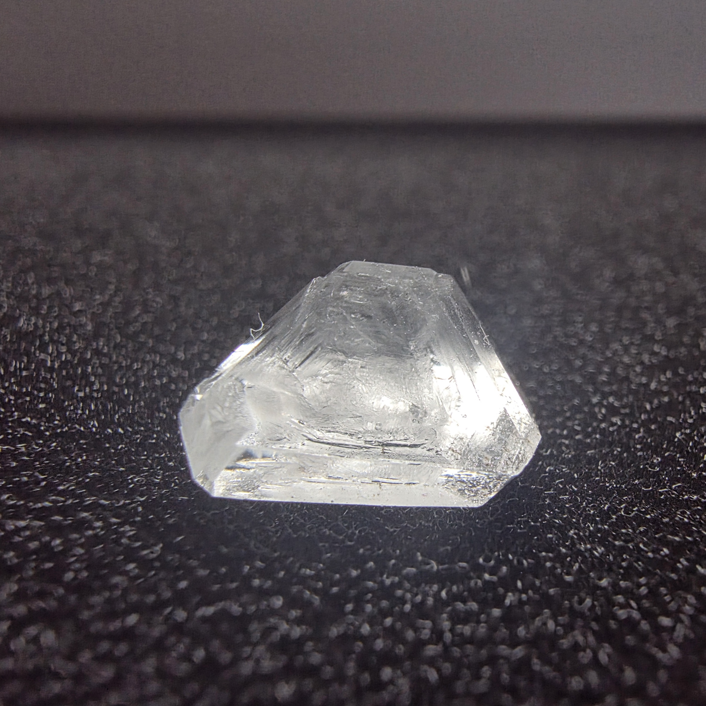
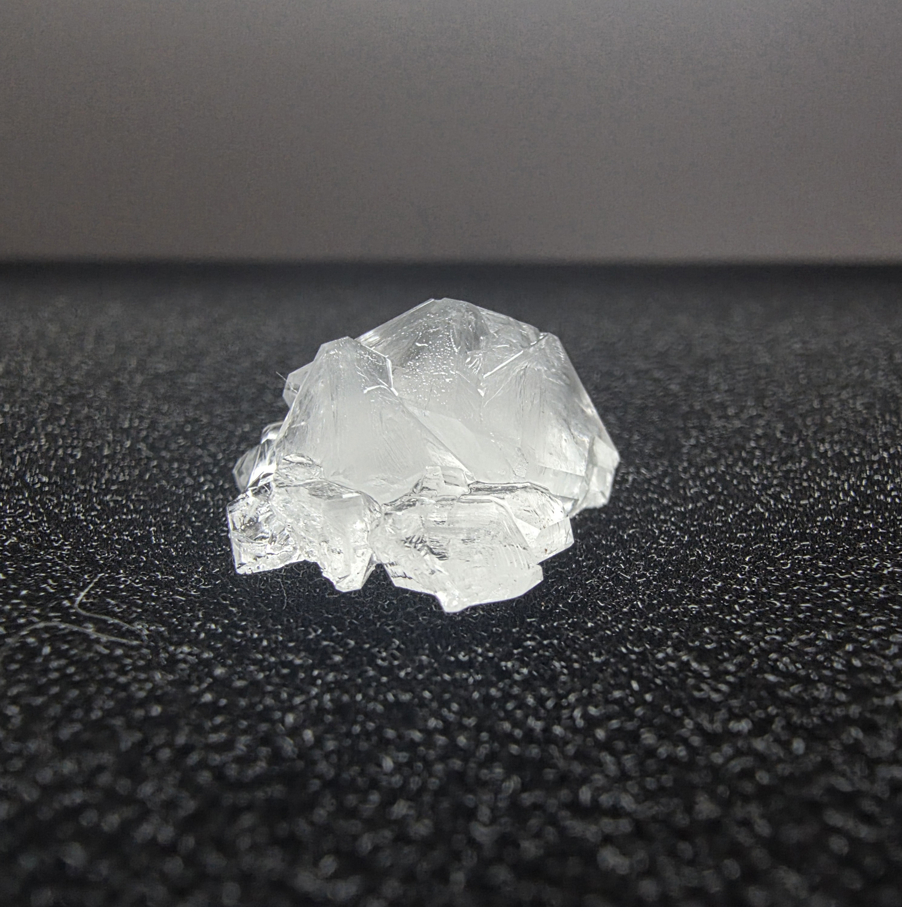
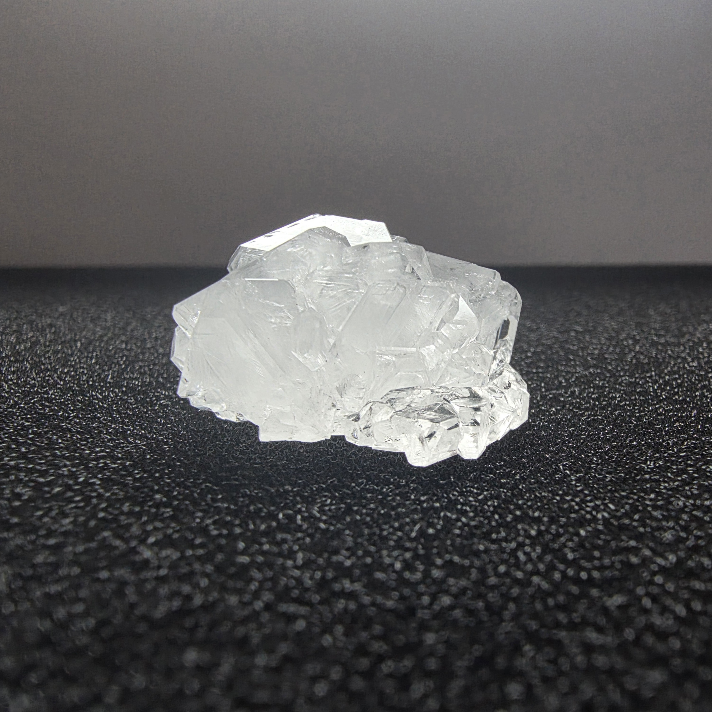
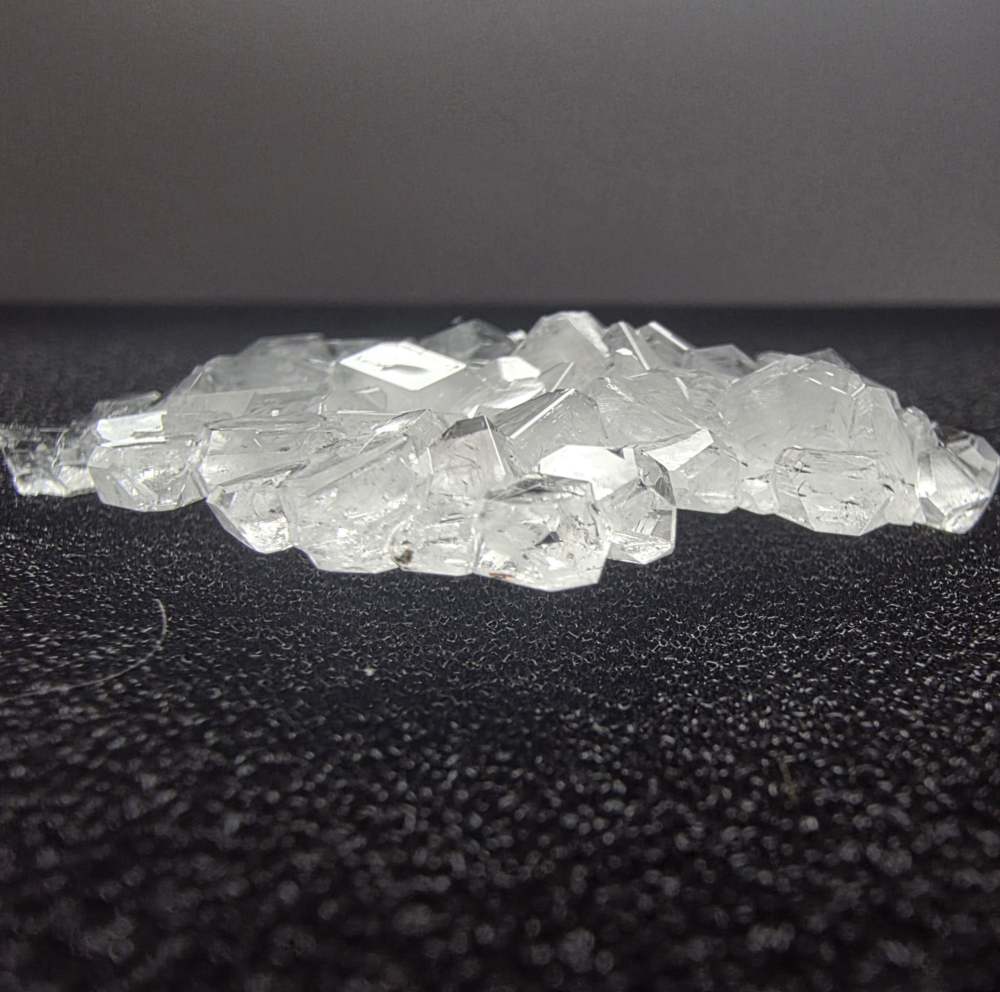
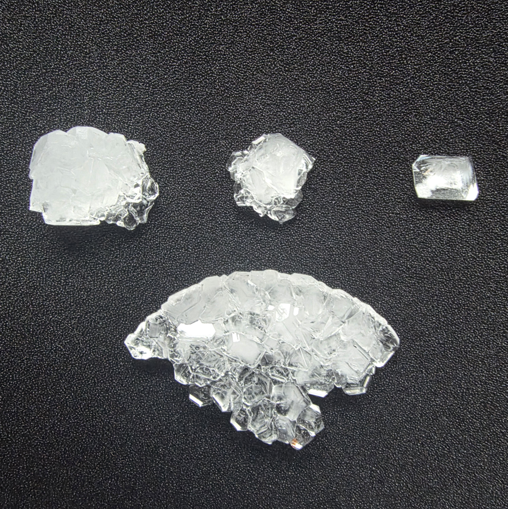

# Alum Crystal Growth

**Status:** Completed

**ID:** NS-E001

**Collection:** NebulaStack-Labs

## Overview

> This experiment was conducted as part of the **NebulaStack-Labs** crystal collection.

> The goal was to grow transparent crystals of **potassium alum (alum)** from an aqueous solution and document the resulting crystal growth.

**Compound:** Potassium alum

**Formula:** KAl(SO₄)₂·12H₂O

**Solvent:** Water

**Initial temperature:** approximately 70 °C

**Primary growth period:** 2 days

**Secondary growth period:** 1 day

## Experimental Process

### 1. Preparing the solution

Potassium alum was added to hot water at approximately **70 °C**.

The solution was thoroughly stirred until the alum dissolved. The solution was prepared in a clean glass jar.

### 2. Initial crystallization

After the alum had dissolved, the jar was closed with a lid and left undisturbed for approximately **two days**.

During this period, the solution gradually cooled and crystals began to form at the bottom of the container.

After two days, several relatively large and transparent crystal formations had developed.

### 3. Selecting the first samples

The resulting crystals were removed from the solution.

Several specimens were selected for the collection, including:

* a fragment of a larger crystal formation;
* a well-formed individual crystal.

These samples were preserved as part of the NebulaStack-Labs collection.

### 4. Secondary crystal growth

One additional crystal was selected and suspended in the same alum solution.

Before the second growth stage, the solution was heated again to dissolve excess crystallized material and create suitable conditions for further growth.

The suspended crystal was then left in the solution for approximately **one additional day**.

### 5. Final result

After the secondary growth stage, additional crystal material had formed.

As a result, the NebulaStack-Labs collection was expanded with **two additional crystal specimens**.

The final samples are transparent to translucent and contain both individual crystal forms and larger crystal aggregates.

## Result

The experiment successfully produced several visible potassium alum crystal specimens.

The most notable characteristics of the resulting samples are:

* transparent and translucent appearance

* clearly visible flat crystal faces

* formation of both individual crystals and aggregates
  
* relatively large crystal formations after only a few days
  
* additional growth during the secondary crystallization stage

The experiment demonstrated that potassium alum can be crystallized using a simple aqueous solution and controlled cooling, with further crystal growth possible using a suspended seed crystal.

## Collection

The resulting specimens were preserved as physical samples for the **NebulaStack-Labs** collection.

Photographs of the crystals are included in this repository as experimental documentation.

© NESTIMS
